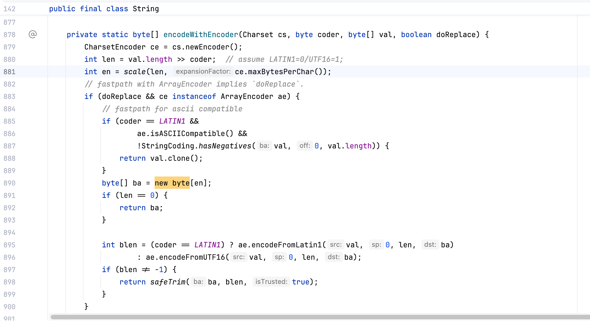

+++
title = 'NegativeArraySizeException报错处理'
date = 2025-12-23T20:02:00+08:00
draft = false

+++

事情的起因是今天看一个mq消费者出现了延迟,然后看了一下是数据量增加了.
然后有延迟就需要解决这个问题,我首先想到的是增大每次写入的数量.
看了下一次写入300W条,然后我就调整成了500W.
过了一会看了一下日志,出现了`java.util.concurrent.ExecutionException: java.lang.NegativeArraySizeException: -1870363507`这个报错.
然后就先把条数调回去了,然后查了一下发现encode最大是有限制的.new byte[en]传入的值是一个int,如果String的数据内部会按`(int)(len * (double)expansionFactor)` 估算字节数组大小,若长度非常大导致 int 溢出,就会导致这个报错
